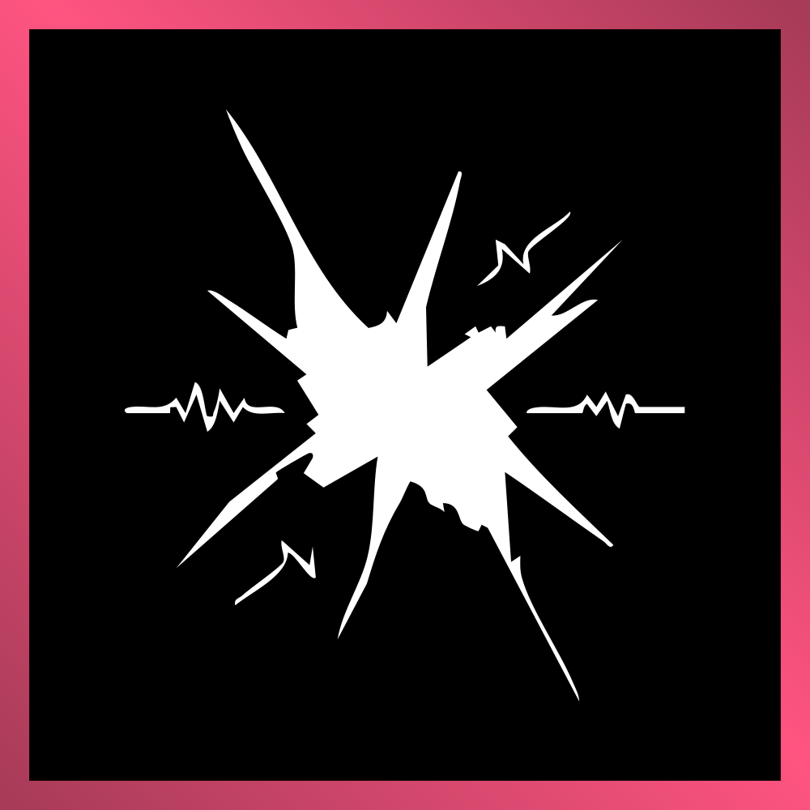
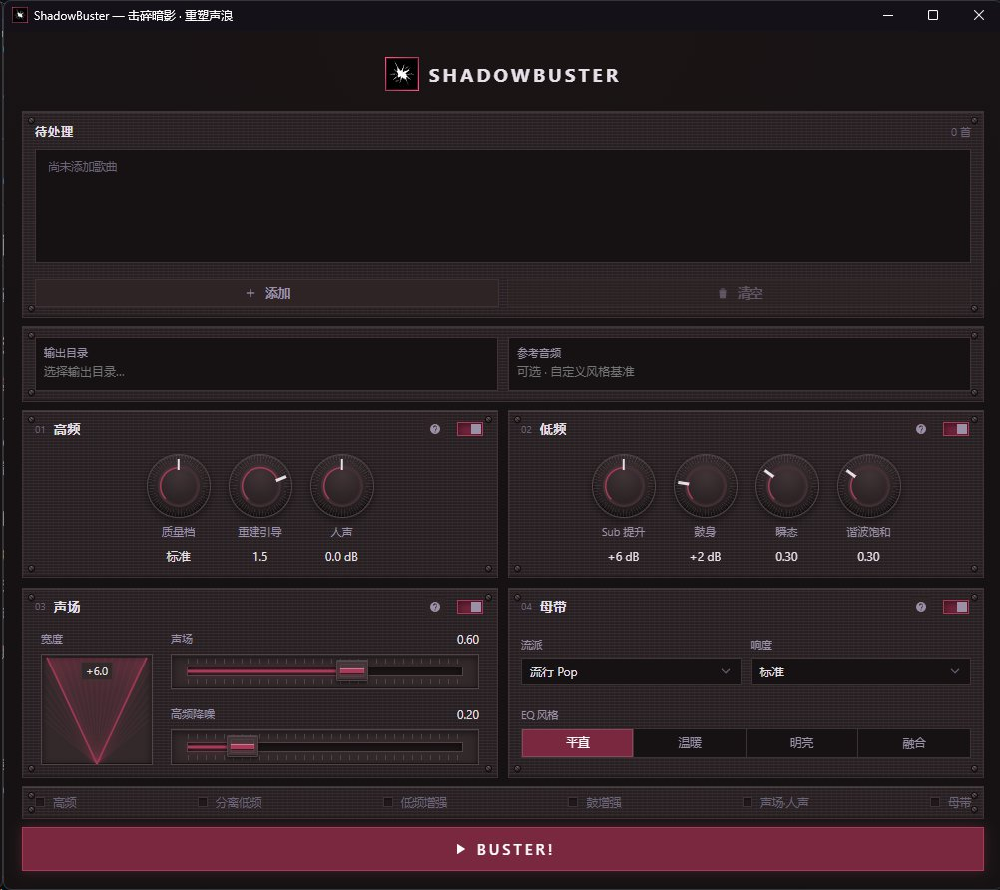

<p align="center">
  
</p>

<h1 align="center">ShadowBuster</h1>

<p align="center">把发闷、发糊的 AI 音乐送进来，经过修复、分轨增强和母带处理，再带着完整动态离开。</p>

<p align="center">
  <a href="https://github.com/AngleNaris/ShadowBuster/releases/latest"></a>
  
  
  
</p>

<p align="center">
  <a href="https://github.com/AngleNaris/ShadowBuster/releases/tag/v1.5.0"><strong>查看 v1.5.0</strong></a>
  &nbsp;·&nbsp;
  <a href="#处理流程">处理流程</a>
  &nbsp;·&nbsp;
  <a href="#运行开发版">运行开发版</a>
  &nbsp;·&nbsp;
  <a href="#构建-windows-安装包">构建安装包</a>
</p>

<p align="center">
  
</p>

---

## 这是什么

ShadowBuster 是面向 AI 生成音乐与有损音频的 Windows 修复、增强和母带工坊。它把高频重建、Demucs 四轨分离、贝斯与鼓增强、人声调整、声场重塑、高频降噪和最终母带串成一条可取消、可观察的桌面流程。

应用使用 PySide6 与 QtWebEngine 构建桌面界面，支持文件拖放、参数持久化、深浅主题和自定义强调色。AI 推理运行时与应用外壳分离；未安装 CUDA 环境时仍可使用 CPU 完成同一套处理。

<table>
  <tr>
    <td width="33%" valign="top"><b>高频重建</b><br><sub>使用 Lew / Apollo 超分辨率模型重绘有损编码中丢失的高频，并通过强度控制混合原始信号。</sub></td>
    <td width="33%" valign="top"><b>四轨分离</b><br><sub>由 Demucs 拆出 vocals、drums、bass 与 other，为分轨增强和残差保留提供基础。</sub></td>
    <td width="33%" valign="top"><b>节奏增强</b><br><sub>分别处理贝斯低频与鼓组瞬态，保留门控与强度控制，避免把整首混音一起染色。</sub></td>
  </tr>
  <tr>
    <td valign="top"><b>人声与声场</b><br><sub>调整人声相对位置，控制 Mid / Side 宽度，并压低 other 轨中的稳态高频噪声。</sub></td>
    <td valign="top"><b>Soren 母带</b><br><sub>执行响度与频谱匹配、Mid / Side 处理、lookahead limiter、真峰值保护和 24-bit dither。</sub></td>
    <td valign="top"><b>桌面工作流</b><br><sub>拖放导入，查看阶段进度，随时取消任务，并保存常用参数与界面主题。</sub></td>
  </tr>
</table>

## 处理流程

```text
Lew 高频重建
→ Demucs 四轨分离
→ 贝斯增强
→ 鼓增强
→ 人声调整
→ 声场重塑 / 高频降噪
→ Soren 母带
```

各阶段保持清晰边界：Lew 负责恢复频带，Demucs 提供可独立处理的轨道，增强阶段只修改对应分轨，最后再由 Soren 完成整体响度、频谱和峰值定版。处理编排、进度和取消由 `studio_backend.py` 统一管理。

## 发布与 GPU 环境

[v1.5.0](https://github.com/AngleNaris/ShadowBuster/releases/tag/v1.5.0) 起采用 CPU 瘦身运行时，CUDA 环境改为在“设置 → GPU 环境”中按需下载。GPU 包支持断点续传、取消和 SHA-256 校验，安装到当前用户目录，不需要管理员权限。

发布说明中的 Windows 安装包为 `ShadowBuster-Setup-1.5.0.exe`，SHA-256：

```text
76ea6a1b6fcf5a825a854230a9129c5af6303ef7bcb49dcb2082b3fb980af15c
```

安装包尚未进行代码签名。请从官方 [GitHub Releases](https://github.com/AngleNaris/ShadowBuster/releases) 获取发布信息，并在运行前核对校验值。

## 运行开发版

准备 Python 3.12+，创建虚拟环境并安装桌面外壳与测试依赖：

```powershell
python -m venv .venv
.\.venv\Scripts\Activate.ps1
pip install PySide6 PyInstaller pytest numpy scipy soundfile
python main.py
```

完整推理还需要 FFmpeg、Apollo 源码与 Lew 权重，以及自行持有的 Soren 组件。通过以下变量指定开发机上的运行时位置：

| 变量 | 用途 |
| --- | --- |
| `SB_PYTHON` | 带 PyTorch 与音频推理依赖的 Python |
| `SB_APOLLO` | Apollo 源码、模型和 Demucs 工具链 |
| `SB_SOREN` | Soren 母带组件 |
| `SB_FFMPEG` | `ffmpeg.exe` 路径 |
| `SB_ASSETS` | 已装配完成的完整 runtime 根目录 |

## 构建 Windows 安装包

```powershell
powershell -File packaging\build_shell.ps1
powershell -File packaging\runtime_sync.ps1
iscc packaging\installer.iss
```

构建顺序是 PyInstaller 桌面外壳、AI runtime 装配和 Inno Setup 安装包。外部模型、闭源 Soren 组件与上游 Apollo 源码不属于本仓库；装配要求见远端仓库的 [`packaging/DEPLOY.md`](https://github.com/AngleNaris/ShadowBuster/blob/main/packaging/DEPLOY.md)。

## 验证

```powershell
python -m pytest tests\ -q
```

## 许可

当前仓库尚未声明项目级开源许可证。外部模型、Apollo、Soren、FFmpeg 与其他第三方组件继续服从各自条款。

项目仓库：[AngleNaris/ShadowBuster](https://github.com/AngleNaris/ShadowBuster)
